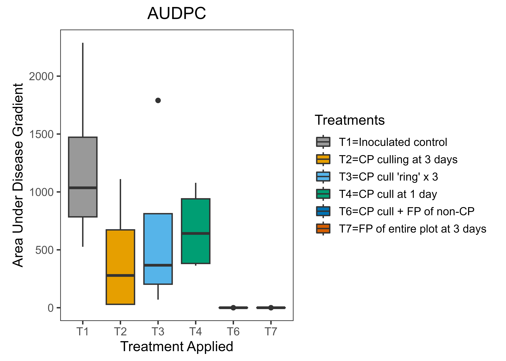

Disease gradient analysis is commonly used in plant disease epidemiology to quantify the spatial distribution of disease intensity relative to the inoculum source or disease focus. One useful summary metric is the Area Under the Disease Gradient (AUDG) curve, which allows quantitative comparison of disease spread among treatments, environments, or management scenarios.

In this post, I demonstrate how to calculate AUDG in R and how the metric can be used to compare spatial epidemic development across multiple conditions.

I am using [Steven Worthington](https://gist.github.com/stevenworthington/)'s ipak function to install and load several packages in R.

```r
ipak <- function(pkg){
    new.pkg <- pkg[!(pkg %in% installed.packages()[, "Package"])]
    if (length(new.pkg)) 
        install.packages(new.pkg, dependencies = TRUE)
    sapply(pkg, require, character.only = TRUE)
}

# usage
packages <- c("tidyverse", "readxl", "agricolae", "ggpubr", "ggpubr", "magrittr", "reshape", "knitr")
ipak(packages)

data <- read_excel("field observation.xlsx") %>% 
        as.data.frame()
head(data, 10)
audpc_data <- data %>% 
  melt(id=c("Distance", "Treatments")) %>%
  group_by(Treatments, variable) %>% 
  summarize(AUDPC = audpc(value, Distance))

audpc_data %>% 
  spread(variable, AUDPC) %>% 
  arrange(Treatments) %>%       
  kable() 

plot_graph <- ggplot(audpc_data, aes(Treatments, AUDPC))+
  geom_boxplot(aes(fill=factor(Treatments))) +
  ggtitle("AUDPC")+
  xlab("Treatment Applied")+
  ylab("Area Under Disease Gradient")+
  theme_bw(base_size = 14)+
  theme(aspect.ratio=1.25,plot.title = element_text(hjust = 0.5), 
        panel.grid=element_blank())+
  scale_fill_manual(name="Treatments", 
                    breaks = c("T1", "T2", 
                               "T3", "T4", "T5",
                               "T6", "T7"),
                    labels=c("T1=Inoculated control", "T2=CP culling at 3 days", "T3=CP cull 'ring' x 3","T4=CP cull at 1 day","T5=FP of CP at 3 days","T6=CP cull + FP of non-CP","T7=FP of entire plot at 3 days"),
                    values=c("#999999","#E69F00","#56B4E9", "#009E73", "#F0E442", "#0072B2", "#D55E00"))


plot_graph

ggsave(filename = "Boxplot.png", width = , height = , units = "in",
       dpi = 600, limitsize = TRUE)
```



